## Parte 1 - Infraestrutura

Para as questões a seguir, você deverá executar códigos em um notebook Jupyter, rodando em ambiente local, certifique-se que:

1. Você está rodando em Python 3.9+
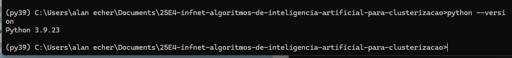
2. Você está usando um ambiente virtual: Virtualenv ou Anaconda
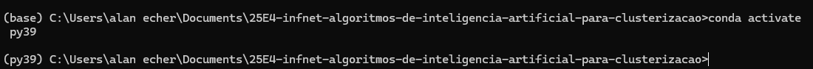
3. Todas as bibliotecas usadas nesse exercícios estão instaladas em um ambiente virtual específico
anaconda - py39
4. Gere um arquivo de requerimentos (requirements.txt) com os pacotes necessários. É necessário se certificar que a versão do pacote está disponibilizada.
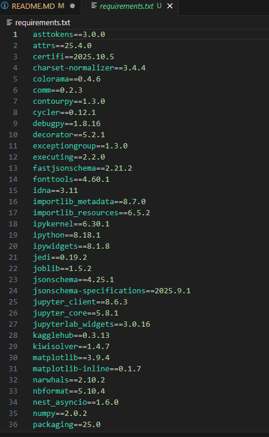
5. Tire um printscreen do ambiente que será usado rodando em sua máquina.
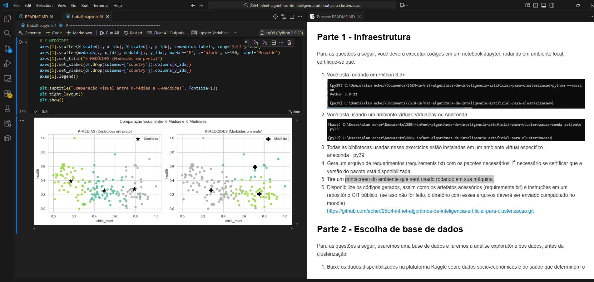
1. Disponibilize os códigos gerados, assim como os artefatos acessórios (requirements.txt) e instruções em um repositório GIT público. (se isso não for feito, o diretório com esses arquivos deverá ser enviado compactado no moodle).
https://github.com/echer/25E4-infnet-algoritmos-de-inteligencia-artificial-para-clusterizacao.git
## Parte 2 - Escolha de base de dados

Para as questões a seguir, usaremos uma base de dados e faremos a análise exploratória dos dados, antes da clusterização.

1. Baixe os dados disponibilizados na plataforma Kaggle sobre dados sócio-econômicos e de saúde que determinam o índice de desenvolvimento de um país. Esses dados estão disponibilizados através do link: https://www.kaggle.com/datasets/rohan0301/unsupervised-learning-on-country-data
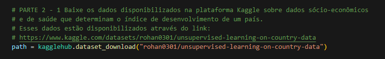
2. Quantos países existem no dataset?
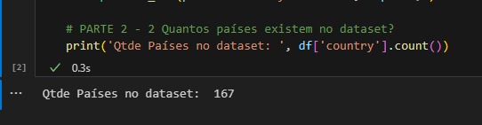
3. Mostre através de gráficos a faixa dinâmica das variáveis que serão usadas nas tarefas de clusterização. Analise os resultados mostrados. O que deve ser feito com os dados antes da etapa de clusterização?
   1. Não há valores nulos no conjunto de dados
   2. Tem 167 países no total
   3. Todas as variáveis são numéricas, exceto a coluna 'country'. 
   4. Foi observado grandes diferenças nas escalas, os dados possuem variação alta, presença de outliers e diferença de escala entre variáveis.
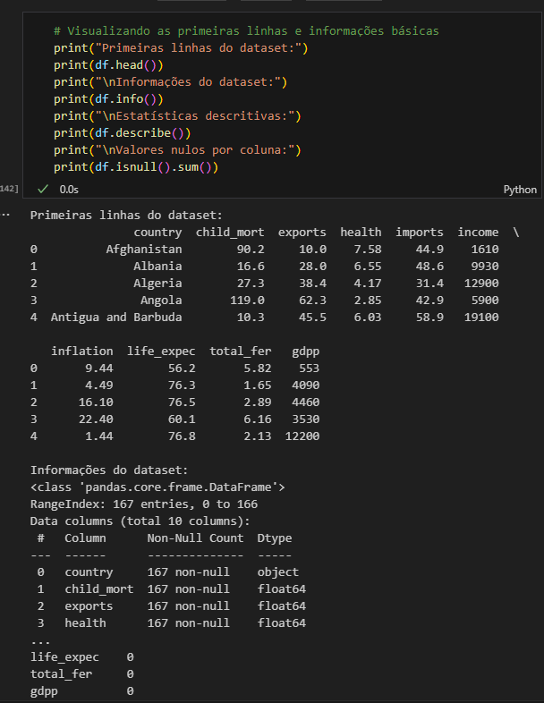
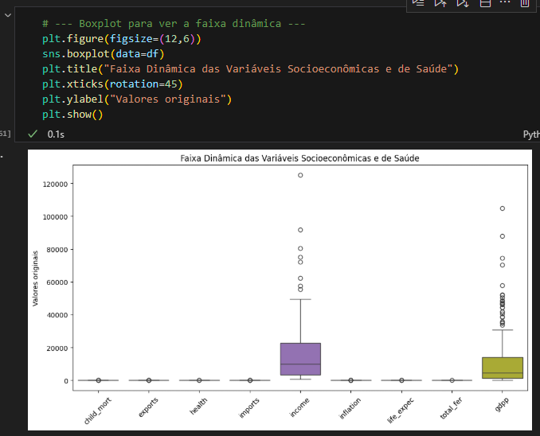
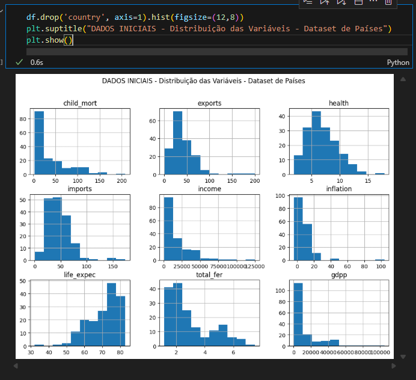
4. Realize o pré-processamento adequado dos dados.
    1. Remocao das colunas nao númericas.
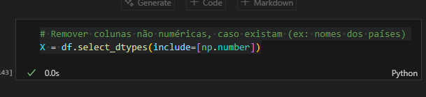
    2. Tratamento de outliers aplicando logaritmos com tratamento para valores negativos.
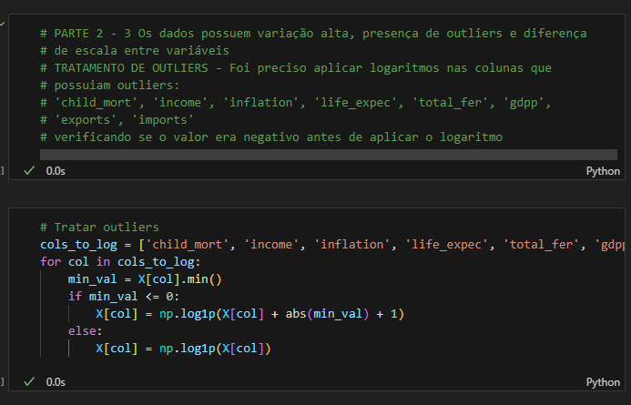
    3. Redução da escala de valores para melhorar o resultado na aplicação dos modelos de clusterização.
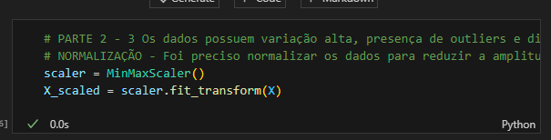 
    4. Resultados obtidos em comparação com os valores iniciais com a redução da escala.
   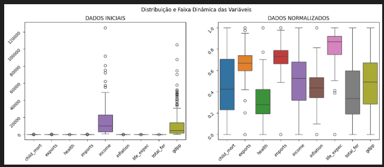
   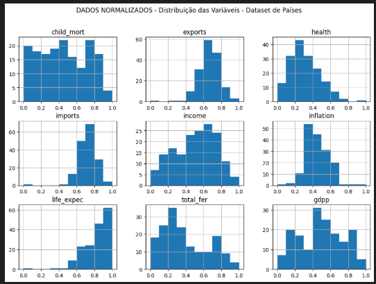
   

## Parte 3 - Clusterização

Para os dados pré-processados da etapa anterior você irá:

1. Realizar o agrupamento dos países em 3 grupos distintos. Para tal, use:
    1. K-Médias
   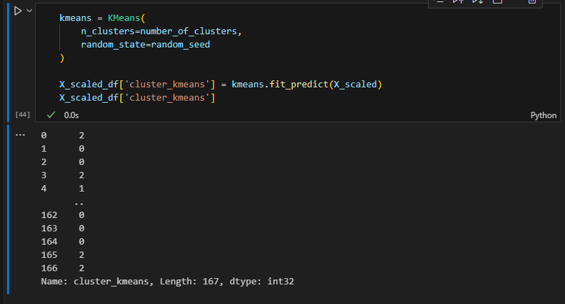
    2. Clusterização Hierárquica
   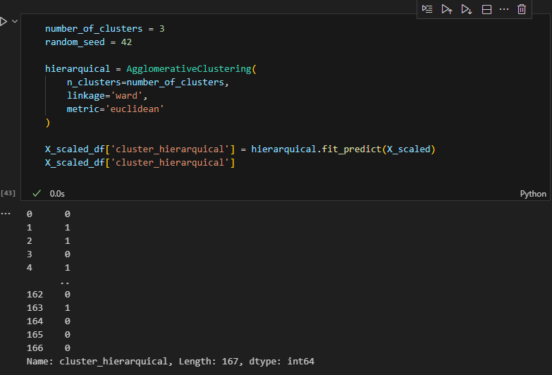
2. Para os resultados, do K-Médias:
    1. Interprete cada um dos clusters obtidos citando:
        1. Qual a distribuição das dimensões em cada grupo
   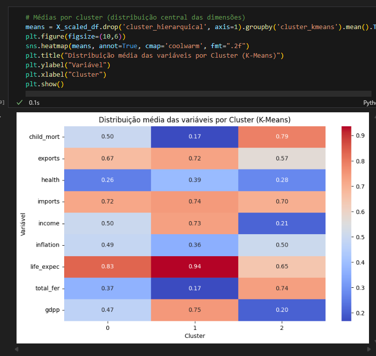
   O algoritmo K-Means conseguiu separar os países em três níveis de desenvolvimento socioeconômico:
    Cluster 0: países emergentes, com indicadores intermediários.
    Cluster 1: países desenvolvidos, com alta renda, PIB e expectativa de vida.
    Cluster 2: países subdesenvolvidos, com baixa renda e alta mortalidade.
        2. O país, de acordo com o algoritmo, melhor representa o seu agrupamento. Justifique
   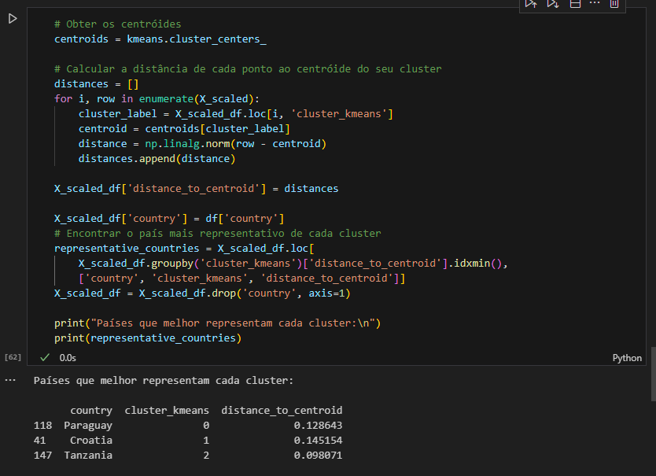
   Cluster 0: O Paraguay foi considerado pelo algoritmo por possuir valores medianos de PIB, mortalidade e expectativa de vida de acordo com seu centróide.
   Cluster 1: A Croácia foi considerado pelo algoritmo por possuir indicadores socioeconômicos muito próximos do centróide de países desenvolvidos.
   Cluster 2: A Tanzânia foi considerado pelo algoritmo por representar a média de países com desafios sociais e econômicos de acordo com seu centróide.
3. Para os resultados da Clusterização Hierárquica, apresente o dendograma e interprete os resultados
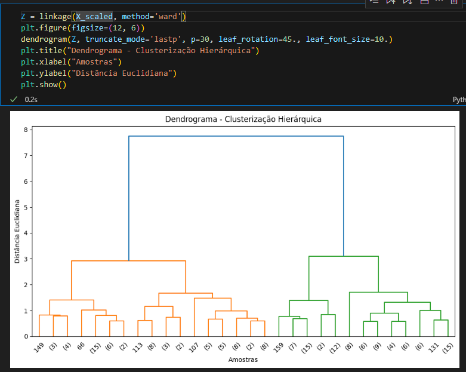
Analisando o dendograma podemos identificar que temos duas grandes estruturas hierárquicas diferentes entre si, olhando no topo do gráfico elas se juntam apenas próximo a distância euclidiana 8, demonstrando essa grande diferença, um grupo deve ter caracteristicas socioeconomicas semelhantes e de nível mais elevado enquanto o outro deve ter indicadores menores com baixa renda e saúde. Olhando mais abaixo na distancia euclidiana de 0 a 3 temos paises bem semelhantes entre si separados em grupos menores com suas particularidades e diferenças de grupos.
4. Compare os dois resultados, aponte as semelhanças e diferenças e interprete.
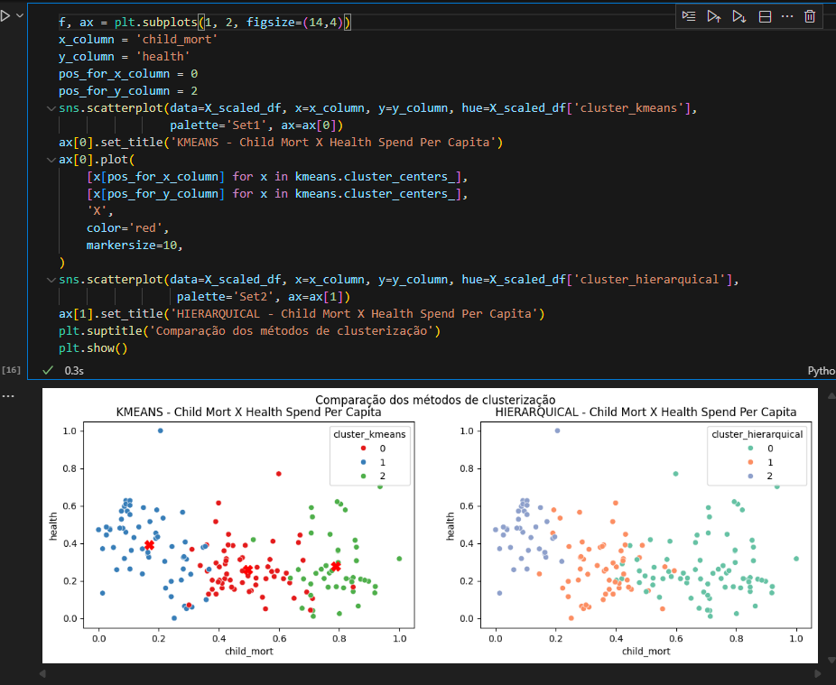
Ambos os algoritmos conseguiram separar os dados em 3 clusters diferentes, lembrando que a separação dos dados em clusters leva em conta todas as colunas que foram passadas para analises, porém montamos o gráfico para comparação utilizando apenas duas colunas health x child_mort, tendo assim uma visao de como foi feito a separação olhando deste ponto de visão. Olhando para os dados de gasto em saude e morte infantil, temos no primeiro terço o kmeans criando o cluster 1 enquanto do outro lado no hierarquico temos o cluster 2, o Kmeans se alongou mais nos dados e pegou uma quantidade maior enquanto o hierarquico se reteve em uma faixa de dados um pouco menor para separação essa faixa de dados é representativa de paises desenvolvidos com baixa mortalidade infantil e alto gasto em saúde. Agora observando o segundo terço de dados temos no kmeans o cluster 0 e no hierarquico temos o cluster 1, nesse caso temos paises intermediários com mortalidade moderada e gastos tipico de economias emergentes, com o hierarquico temos o inicio do grupo em iniciando em mortalidade infantil aproximada de 0.2 e terminando logo após 0.4 enquanto no kmeans temos o grupo iniciando em meados de 0.3 e terminando em 0.7 uma diferença até bem significativa na divisão dos dados, lembrando que os dados foram divididos utilizando todas as colunas numéricas do dataset e não apenas as duas colunas analisadas. E no último terço dos dados temos ali no kmeans um grupo bem menor enquanto no hierarquico temos um grupo bem maior de paises, que representam paises com alta mortalidade infantil.

## Parte 4 - Escolha de algoritmos

1. Escreva em tópicos as etapas do algoritmo de K-médias até sua convergência.
   O primeiro passo é definir o número de clusters para o algoritmo formar, depois o algoritmo irá selecionar aleatoriamente centroides iniciais aleatórios, em seguida as amostras de dados são atribuidas ao centroide do cluster mais próximo utilizando a distância euclidiana, após essa atribuição é recalculado os centroides com base como a média das amostras pertencentes a cada grupo, este processo de atribuição e atualização dos centroides é repetido de forma a atingir a convergência, quando não há mais mudanças significativas na posição dos centróides ou dos clusters.
2. O algoritmo de K-médias converge até encontrar os centróides que melhor descrevem os clusters encontrados (até o deslocamento entre as interações dos centróides ser mínimo). Lembrando que o centróide é o baricentro do cluster em questão e não representa, em via de regra, um dado existente na base. Refaça o algoritmo apresentado na questão 1 a fim de garantir que o cluster seja representado pelo dado mais próximo ao seu baricentro em todas as iterações do algoritmo.
Obs: nesse novo algoritmo, o dado escolhido será chamado medóide.
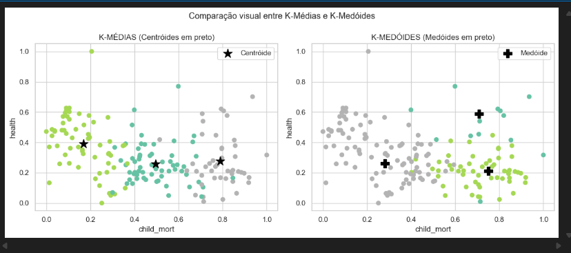
1. O algoritmo de K-médias é sensível a outliers nos dados. Explique.
O k-means é sensível a outlier de dados pois calcula o centroide de cada cluster utilizando a média dos pontos pertencentes a ele, quando há valores distantes extremos no conjunto de dados isso acaba impactando e puxando a média para fora da região central, deslocando o centróide, podendo gerar agrupamentos incorretos ou pouco representativos.
2. Por que o algoritmo de DBScan é mais robusto à presença de outliers?
O algoritmo DBScan utiliza uma técnica diferente baseado na densidade de pontos próximos  no espaço, um ponto é considerado core se tiver um número minimo de vizinhos a um certo raio de distância, enquanto um ponto que estiver muito distante de uma região densa de vizinhos são simplesmente rotulados como ruidos e não influenciam na formação dos clusters.

Assim que terminar, salve o seu arquivo PDF e poste no Moodle. Utilize o seu nome para nomear o arquivo, identificando também a disciplina no seguinte formato: “nomedoaluno_nomedadisciplina_pd.PDF”.